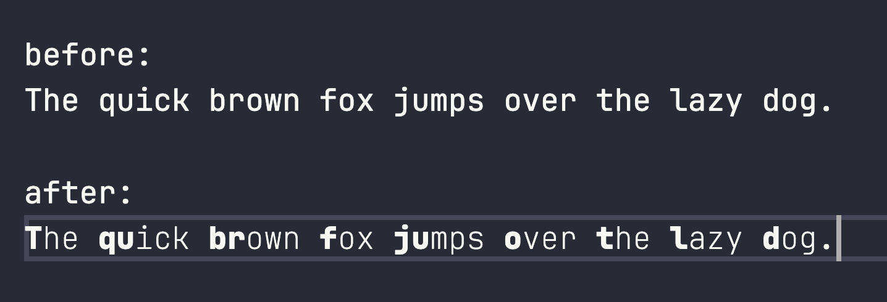
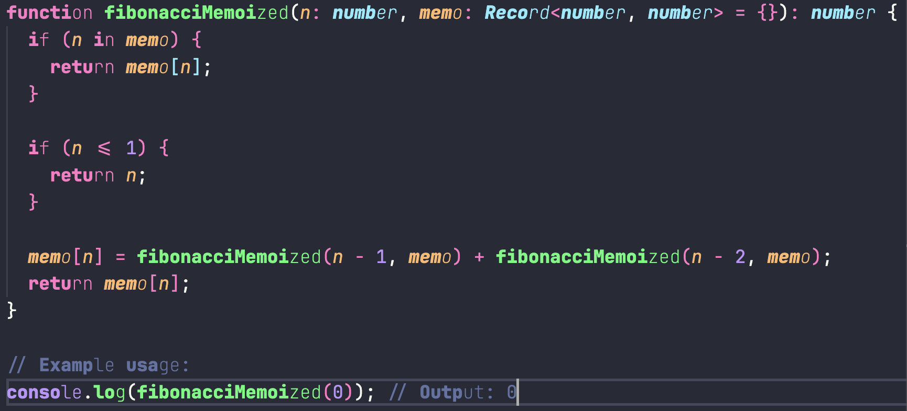

# CodeVide


> **Support all languages that separate words with spaces**

This extension is an open source implementation that mimics the behavior of the [Bionic Reading API](https://bionic-reading.com/).
Inspired by [TextVide](https://github.com/Gumball12/text-vide).

-   _[I don't think it's going to be more readable](https://github.com/Gumball12/text-vide/blob/main/ABOUT_READABILITY.md)_

## 💫 Features

| Feature                                       | State |
| --------------------------------------------- | ----- |
| [Custom `sep` Style](#options-sep)            | ✅    |
| [Fixation-Points](#options-fixationpoint)     | ✅    |
| [Extra Contrast](#options-extracontrast)      | ✅    |
| [Current Line Only](#options-currentlineonly) | ✅    |

## 📸 Screenshots



> font: `JetBrains Mono` settings used: `sep: ['', '']`, `fixationPoint: 5`, `extraContrast: true`, `currentLineOnly: true`



> font: `JetBrains Mono` settings used: `sep: ['', '']`, `fixationPoint: 1`, `extraContrast: true`, `currentLineOnly: false`

## 📥 Installation

Install from the [VS Code Marketplace](https://marketplace.visualstudio.com/items?itemName=timescam.code-vide).

Can also be installed in VS Code: Launch VS Code Quick Open (Ctrl+P), paste the following command, and press Enter.

```
code --install-extension timescam.code-vide
```

## ⚙︎ Options

### `sep`<a id="options-sep"></a>

-   Default: `['', '']`

Passing a string allows you to specify the Prefix and Suffix of the highlighted word at once.
It can also set them up by passing a list of length 2.


### `fixationPoint`<a id="options-fixationpoint"></a>

-   Default: `1`
-   Range: `[1, 5]`

Controls how much of each word is bold. The levels work as follows:

- Level 1: Bolds larger chunks of words, best for quick reading
- Level 2: Balanced bolding, good for most text
- Level 3: Medium-sized bold sections
- Level 4: Smaller bold sections
- Level 5: Minimal bolding, best for careful reading

### `extraContrast`<a id="options-extracontrast"></a>

-   Default: `false`

If this option is `true`, the later half of text will be set to thin for extra contrast.

### `currentLineOnly`<a id="options-currentlineonly"></a>

-   Default: `false`

If this option is `true`, the decorations will be applied only to the current cursor line.

### `debounceDelay`

-   Default: `150`
-   Range: `[0, 1000]`

Delay in milliseconds before updating the text decorations after changes. Do not change this value unless you know what you are doing.

## License

[MIT](./LICENSE) @rexkyng
